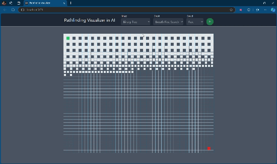

# Pathfinding Visualizer

### React + TypeScript + Tailwind

#### [Deployed app]()



### Get Started From Scratch

```
❯ npm create vite@latest pathfinding-visualizer -- --template react-ts
❯ npm install -D tailwindcss postcss autoprefixer
❯ npx tailwindcss init -p
❯ npm i
❯ npm run dev
```
